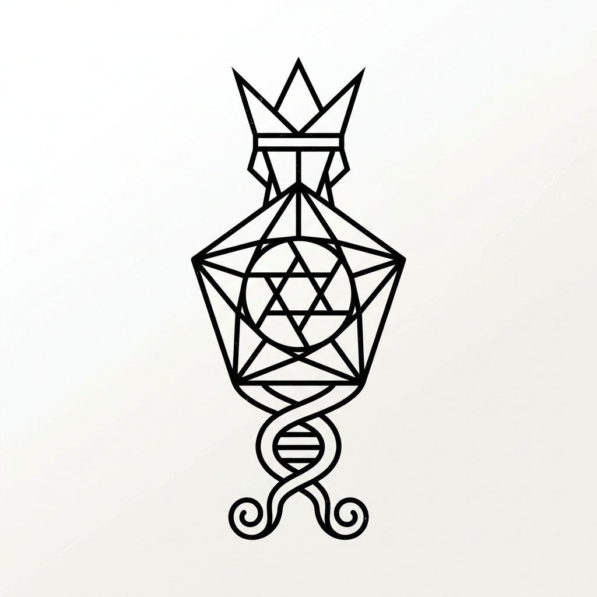

<p align="center">
  
</p>

<h1 align="center">S P E C T R E</h1>

<p align="center">
  <em>Videt Omnia</em><br/>
  <strong>A covert vehicle intelligence system that makes every commercial dashcam look like a toy from 2015.</strong>
</p>

<p align="center">
  <a href="https://spectre-dashboard.vercel.app">🔗 Live Dashboard</a> ·
  <a href="#the-system">The System</a> ·
  <a href="#philosophy">Philosophy</a>
</p>

---

## The System

Project Spectre is a military-grade, fully concealed multi-camera surveillance platform built into a 2017 VW Scirocco Mk3 R-Line. Zero visible hardware. Zero cloud dependency. Total sovereignty.

| Spec | Target |
|------|--------|
| Cameras | 4× concealed (front 4K IMX678, 2× side IMX307, rear IMX307) |
| Compute | Raspberry Pi CM5 (4GB) + NVMe 980 PRO |
| Night Vision | Sony STARVIS 2 — better than human eye |
| Storage | 1TB NVMe + self-hosted cloud archive |
| Sentry Mode | 72+ hours on dedicated LiFePO4 |
| Remote Access | Tailscale mesh VPN — anywhere on the planet |
| Power Draw | < 2W sentry · < 15W recording |
| Visibility | Zero. If you can see the camera, the installation failed. |

## The Dashboard

The interactive engineering dashboard includes:

- **📊 System Overview** — architecture, components, power budget
- **⚡ Interactive Schematic** — click any node to inspect. Zoom. Pan. Trace wires.
- **🔧 4-Phase Installation Walkthrough** — clickable steps that highlight the schematic in real-time
- **🛒 BOM / Shopping List** — phase-coded, with live cost estimates

The entire dashboard ships as a **single 148KB HTML file** — no dependencies, no frameworks, no server. Open it anywhere.

## Philosophy

> *We don't build products. We build systems that shouldn't exist yet.*

Every dashcam on the market is fundamentally broken: visible, low-quality, captive storage, no autonomy, battery-illiterate. We fix all of it. Not incrementally — **categorically.**

The uninitiated see a car. The initiated see a temple.

```
▽ Sophia watches from below
△ The Demiurge watches from above
◎ The aperture sees all
```

## Architecture

```
                    ┌─────────────┐
                    │   SOPHIA    │  ← Front 4K (IMX678)
                    │  ◎ STARVIS  │
                    └──────┬──────┘
                           │ CSI-2
    ┌──────────┐    ┌──────┴──────┐    ┌──────────┐
    │   BOAZ   │◄───┤  THE MONAD  ├───►│  JACHIN   │
    │  ◎ Left  │USB │  Pi CM5 4GB │USB │  ◎ Right  │
    └──────────┘    │             │    └──────────┘
                    │  ┌───────┐  │
                    │  │AKASHIC│  │  ← NVMe 980 PRO
                    │  │RECORD │  │
                    │  └───────┘  │
                    └──────┬──────┘
                           │ USB
                    ┌──────┴──────┐
                    │   PISTIS    │  ← Rear (IMX307)
                    │  ◎ Witness  │
                    └─────────────┘
```

## Deploy

This is a static site. One HTML file. Deploy anywhere:

```bash
# Local
open index.html

# Vercel
vercel --prod

# Netlify
netlify deploy --prod --dir .

# Or just text it to someone
```

## License

This project is private and proprietary. The dashboard is shared for reference only.

---

<p align="center">
  <sub>The Monad emanates · The Pleroma watches · ΑΒΡΑΞΑΣ</sub>
</p>
